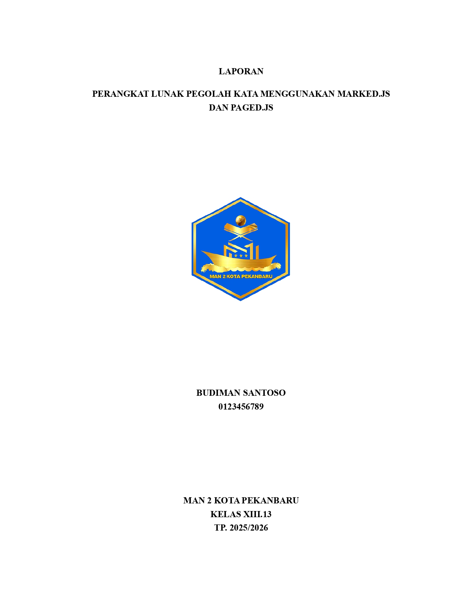
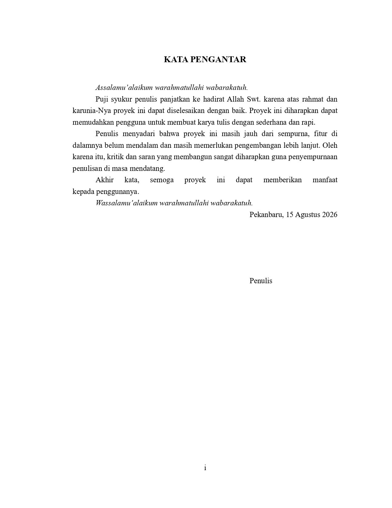

# Skripsify

Skripsify is a Markdown renderer for “formal”-styled paper, usually used in Indonesia, such as *skripsi*, *makalah*, *proposal*, etc.. Skripsify is powered by:

- **Marked.js** for Markdown to HTML;
- **MathJax** for math rendering; and
- **Paged.js** for print layout.

## Overview

Here is an example of the rendered markdown:





### Examples

For [this source](assets/example/2/source.md), renders to [this PDF](assets/example/2/render.pdf)

## Quick Start

### Installation

```sh
npm install -g https://github.com/zf-ran/skripsify/releases/download/v1.1.0/skripsify-1.1.0.tgz
```

### Run

```sh
skripsify
```

This will start the server on `127.0.0.1:4129` by default. To open the markdown file, go to `http://ip:port/app/<markdown_file>`, note that to open a markdown file, no `.md` extension is needed!

It will search the confing on

- **Linux:** `~/.config/skripsify/config.yaml`
- **Windows:** `%APPDATA%\skripsify\config.yaml`

If not found, it will generate one automatically. The default config can be
viewed [here](default-config.yaml).

## Configuration

| Key                | Default                      | Description                                  |
| ------------------ | ---------------------------- | -------------------------------------------- |
| `host`             | `127.0.0.1`                  | Server hostname or IP address to bind to     |
| `port`             | `4601`                       | TCP port for the Skripsify web server            |
| `contentDirectory` | `~/Documents/Skripsify/Contents` | Directory containing markdown files to serve |
| `assetDirectory`   | `~/Documents/Skripsify/Assets`   | Directory containing static asset files      |

By default, the working directory is

- **Linux:** `~/Documents/Skripsify/`
- **Windows:** `%USERPROFILE%\Documents\Skripsify`

Where that folder has `Assets/` and `Contents/` folder. All of your markdown
files needs to be placed in `contentDirectory`.

To load asset files from your `assetDirectory` folder, go to
`http://ip:port/assets`.

## License

This project is licensed under the GNU General Public License v3.0, see the
[LICENSE](LICENSE) file for details.